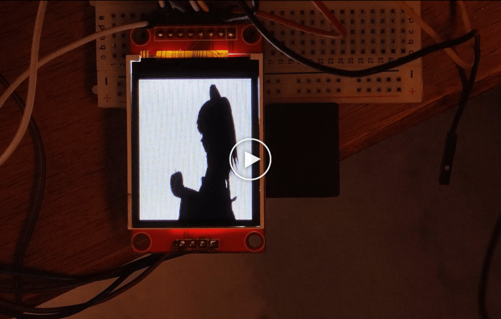
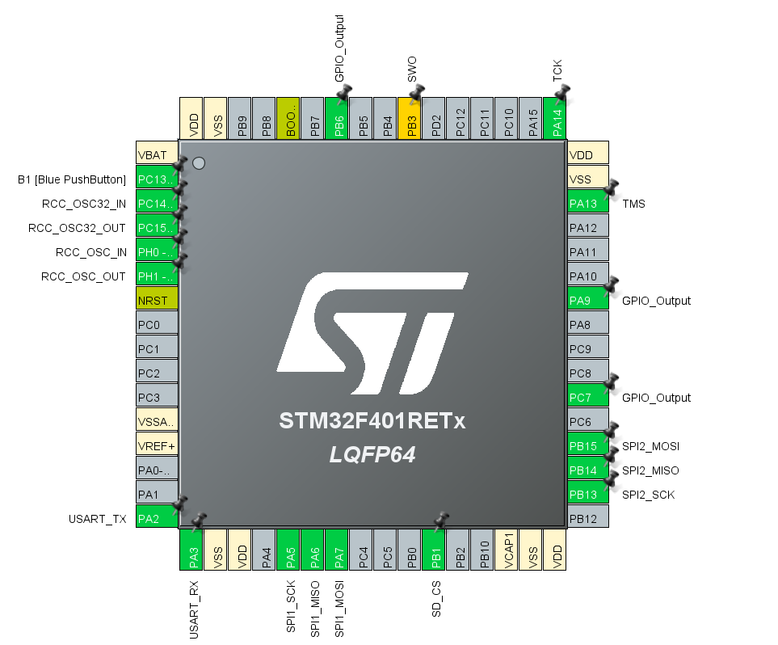

# ST7735-VideoPlayback-STM32

A library for smooth video playback on a ST7735 display. It uses an SD card module for video storage. The library can be used to streams videos at **33-35FPS**.

## Showcase

Watch the Showcase on Youtube:

[](https://www.youtube.com/watch?v=RFqV02wlCG8)

## Pinout



ST7735 Display:
| **Display Pin**     | **Connection**  |
|---------------------|-----------------|
| LED (Backlight)     | 5V              |
| SCK (CLK)           | SPI1_SCK        |
| SDA                 | SPI1_MOSI       |
| DC (Data/Command)   | PA9             |
| RESET               | PC7             |
| CS (Chip Select)    | PB6             |
| GND                 | GND             |
| VCC                 | 5V              |

SD Card Module:
| **SD Module Pin**    | **Connection**  |
|----------------------|-----------------|
| SD_CS                | PB1             |
| SD_MOSI              | SPI2_MOSI       |
| SD_MISO              | SPI2_MISO       |
| SD_SCK               | SPI2_SCK        |

If you are using the on-display SD card module, VCC and GND are used from the display pin connections.

## Usage

TBD:
- CubeMX steps
- Pinout connections
- Sources copy
- Compiling the code
- Video binary generation
- SD card formatting + vid/ directory
- Flash the code and run

## Video Conversion Script

The python script is located at `video_converter/video_converter.py`. It is used to convert a video file to the usable video binary format.

The output binary `video.bin` is generated in `video_converter/video_output`.
```
$ python video_converter.py -h
usage: video_converter.py [-h] [--start START]
                          [--end END] [--landscape]
                          video_input

Convert video to binary format for display.

positional arguments:
  video_input    Path to input video

options:
  -h, --help     show this help message and exit
  --start START  Start time MM:SS
  --end END      End time MM:SS
  --landscape    Use landscape mode for display
```

### Video Format

The video binary follows the below format. This section can be used as a reference for debugging video and frame information.

The file consists of a header followed by per frame data.
```
Header:
[video_width HB][video_width LB][video_height HB][video_height LB][num_frames HB][num_frames LB]

Per Frame:
['F']['R']['M'][Pixel Data ...]

Pixel Format:
- Each pixel color is 2 bytes in RGB565 form:
[RGB565 Color HB][RGB565 Color LB]
```
Here,
- HB - Higher byte
- LB - Lower byte

## Optimizations
- Using DMA for SD TX and RX.
- Using DMA for ST7735 Display TX.
- Modified FATFS User SPI drivers to allow multi-byte SPI TransmitReceive.
- Using prescaler=2 for SD reading in `FCLK_FAST`.

Current per-frame timing information:
```
Frame read time: ~22ms
Frame draw time: ~8ms
```

Possible optimizations:
- RLE (Run length encoding) and dirty rectangles implementation. (with thresholds to reduce per frame CPU overhead)

## Notes
- Mounting/Interfacing the SD card can be nasty over SPI, by giving errors multiple times.
    - Make sure that the SD pins were set to pull-up in CubeMX. See this for [reference](https://github.com/kiwih/cubeide-sd-card/issues/2).
    - Make sure all the connections to the SD card are tight.
    - Try reducing `FCLK_SLOW` and `FCLK_FAST` prescalers by using the prescalers specified [here](https://github.com/kiwih/cubeide-sd-card/blob/master/cubeide-sd-card/FATFS/Target/user_diskio_spi.c). 

## Libraries Used
- FATFS
- [cubeide-sd-card](https://github.com/kiwih/cubeide-sd-card) for the FATFS User SPI drivers
- [stm32-st7735](https://github.com/afiskon/stm32-st7735)
- [LVGL's Image Converter](https://github.com/lvgl/lvgl/blob/master/scripts/LVGLImage.py)

## References
- [ST7735 Datasheet](https://www.displayfuture.com/Display/datasheet/controller/ST7735.pdf)
